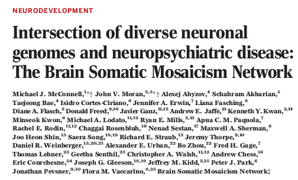
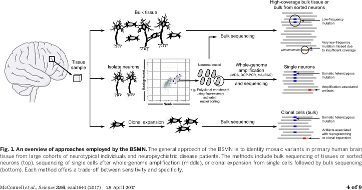
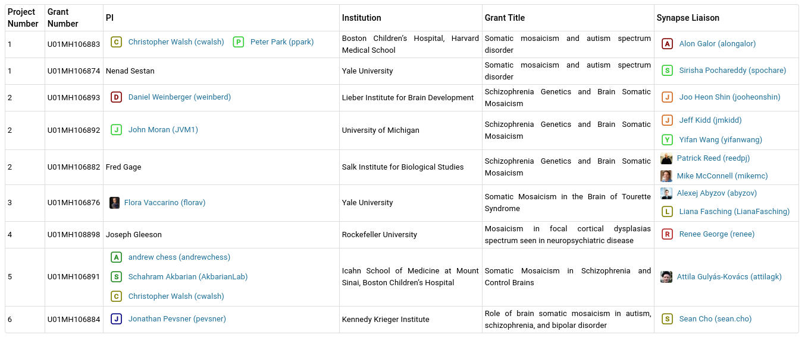
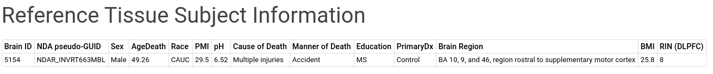
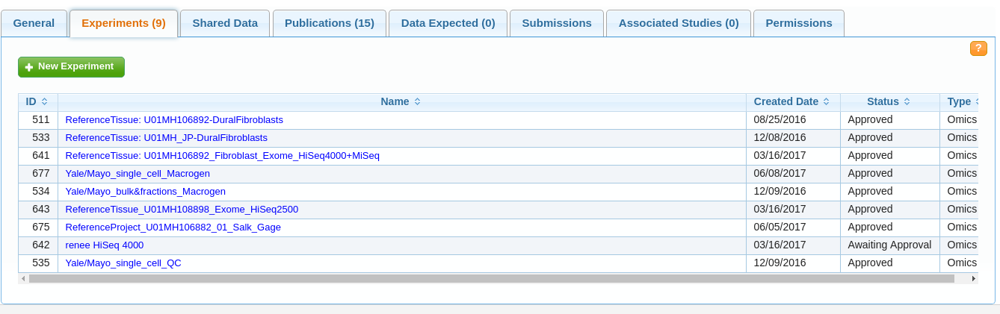
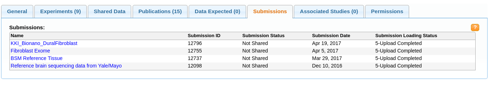

## 

Science  28 Apr 2017: Vol. 356, Issue 6336, eaal1641 DOI: [10.1126/science.aal1641](http://dx.doi.org/10.1126/science.aal1641)

## BSMN Overview

- Research has identified many heritable variants associated with susceptibility to neuropsychiatric disease, but do not fully account for disease risk
- 80 billion neurons in the brain, large potential for somatic mutations arising from DNA damage
- Long lifespan of neurons, direct relationship between neural circuits and behavior suggests potential for small populations of neurons affecting neurodevelopment and disease

10.1126/science.aal1641

## BSMN Overview

> somatic mosaicism: existence of different genomes within the cells of a monozygotic individual

A number of other neurological diseases with somatic variants:

- focal dysplasia, hemimegalencephaly, CLOVES, Proteus syndrome (PI3K-AKT-mTOR)
- Focal cortical dysplasia, type II (PI3K-AKT-mTOR)
- NF type 2 (RAS, PI3K-AKT-mTOR)

- Examine collections of post mortem tissue from neurotypical individuals and patients with neuropsychiatric disorders
- Apply genomic sequencing technologies to DNA from the brain and single neuronal genomes

10.1126/science.aal1641

## BSMN Overview

10.1126/science.aal1641

## BSMN Variant Prioritization

- Absence from the germ line
- Recurrence and frequency of somatic variation
- Mutation severity
- Intersection with known disease loci and biochemical pathways
- Intersection with brain expression and epigenomic data (BrainSpan, PsychEncode)

10.1126/science.aal1641

## BSMN Partners and Studies

Also: Reference Tissue Project

## BSMN Reference Tissue Project

- Brain from a single individual provided by the Lieber Institute
- Consists of pulverized postmortem brain tissue, sorted nuclei from NeuN+ neurons and NeuN- cells, and dural fibroblasts

## BSMN Reference Tissue Project

- More than 40 planned experiments across 9 groups
- WGS, WES, SLAV-Seq, Bionano optical genome imaging
- Illumina and 10X Genomics platforms

https://www.synapse.org/#!Synapse:syn10170802/tables/

## Data partner - NIMH Data Archive

https://data-archive.nimh.nih.gov/

## NIMH Data Submission

1. Obtain an NDA user account (https://ndar.nih.gov/request_access.html)
1. Provide a [**Data Submission Agreement**](https://ndar.nih.gov/ndarpublicweb/Documents/NDAR%20Submission%20Request.pdf)
1. Gain access to the BSMN data Collection
1. Contact @kdaily (kenneth.daily@sagebase.org) with username and email used to create NDA account
1. Create an Experiment, which provides information on acquisition, processing, or other parameters describing how the data was collected
1. Complete subject, sample and tissue metadata manifests
1. Use the NDA Validation and Upload Tool to submit the data (GUI or command line)

## Data flow (ideal)

1. BSMN Lab
1. NDA Experiment
1. NDA Submission
1. NDA API
1. Synapse

 

## Data flow (real)

1. BSMN Lab
1. Me
1. BSMN Lab
1. NDA
1. Me
1. BSMN Lab
1. NDA Submission
1. (Me <-> NDA) $\times n$
1. NDA API
1. Synapse

## Reference Tissue Project - Experiments

> Capture experimental and technical conditions

## Reference Tissue Project - Submissions

> The data files associated with an experiment

## Reference Tissue Project - Synapse

## Reference Tissue Project Data - Synapse

https://www.synapse.org/bsmn_private (Tables)

## Getting data

http://docs.synapse.org/

1. Use one of the Synapse clients (R or Python)
1. Use one of the other Synapse clients (R or Python)
1. Use the Synapse client to figure out AWS S3 path

## Using the data

Discussion Forum!

https://www.synapse.org/#!Synapse:syn5902559/discussion/threadId=1464

## Metadata and standards

1. Sample metadata (some through NDA submission)
1. Experiment metadata (from NDA submission)
1. For use in analysis? (?????)

## It should get easier

1. Learned from reference tissue project
1. NDA is getting better
1. Keep communication lines open - early and often

## Thank you

> Send me updates on data generation in the Synapse Wiki!

https://www.synapse.org/#!Synapse:syn5902559/wiki/415457

[kenneth.daily@sagebase.org](mailto:kenneth.daily@sagebase.org)
